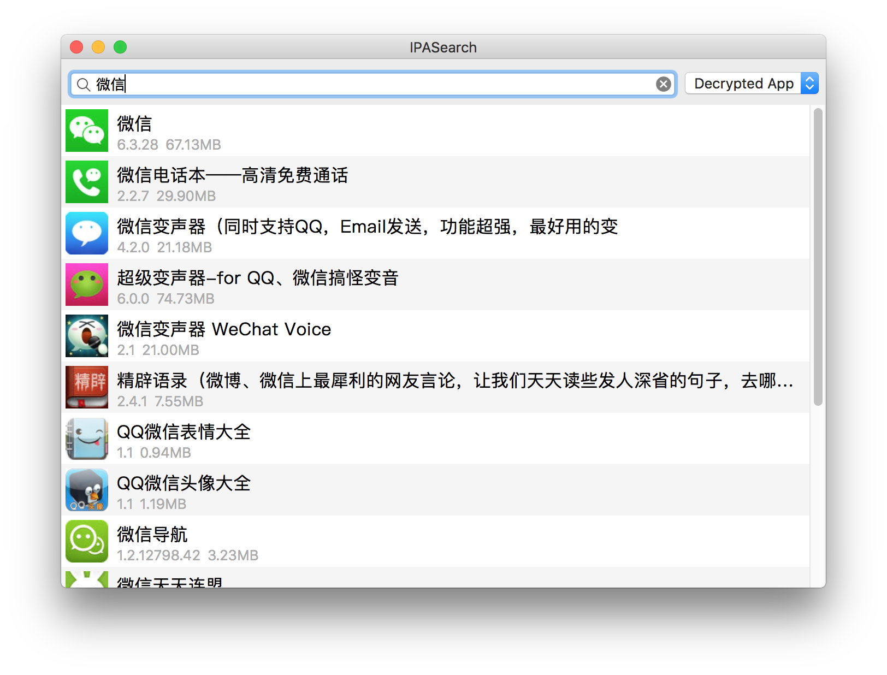

# IPASearch

&nbsp;&nbsp;&nbsp;&nbsp;&nbsp;&nbsp;

没有越狱 iOS 设备的时候无法使用 [Clutch](https://github.com/KJCracks/Clutch) 等工具砸壳，通常的做法是下载「XX 助手」等盗版应用商店提供的「越狱版」的已经经过砸壳的 IPA 文件。

这是一个搜索并下载 [PP 助手](http://www.25pp.com/)应用市场里的 IPA 文件的工具。为什么不用 PP 助手客户端而要自己写一个？因为有病。

双击或选中回车下载，选中时也可在 Touch Bar 点按下载或查看 App 描述。因为懒得做 UI，所以查看 App 描述的功能为 Touch Bar 独占。

**所下载的文件仅供逆向工程研究使用**。

